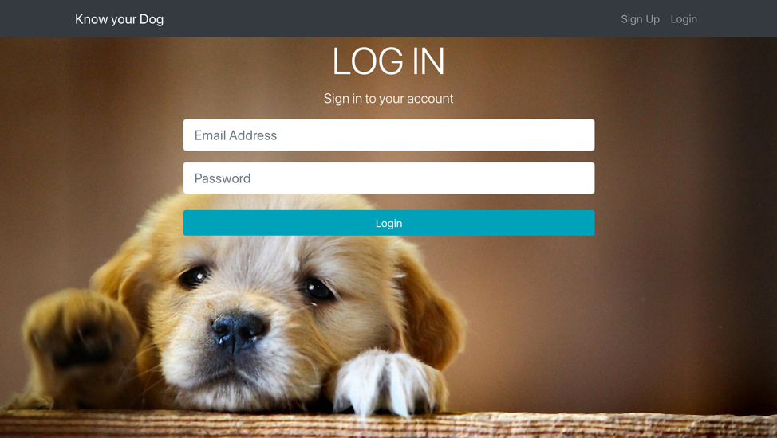

# know-your-dog

## Introduction

Image recognition refers to technologies that identify places, logos, people, objects, buildings, and several other variables in images. Users are sharing vast amounts of data through apps, social networks, and websites. Additionally, mobile phones equipped with cameras are leading to the creation of limitless digital images and videos. The large volume of digital data is being used by companies to deliver better and smarter services to the people accessing it.

Image recognition is a part of computer vision and a process to identify and detect an object or attribute in a digital video or image. Computer vision is a broader term which includes methods of gathering, processing and analyzing data from the real world. The data is high-dimensional and produces numerical or symbolic information in the form of decisions. Apart from image recognition, computer vision also includes event detection, object recognition, learning, image reconstruction and video tracking.

Building a full stack application involves setting up a database along with working on the client and server-side development. This project aims at building a full stack web application that identifies the breed of dogs from pictures. The application also stores all the images previously uploaded by the user and stores its associated labels along with the probability score into the database. This project deals with efficiently storing the images on the cloud and performing image recognition of images and processing the results to store into a database. It also deals with graphical representation of the probability score of the results obtained from image recognition. 

## SETTING UP THE ENVIRONMENT

### SETUP SERVER

#### Create a Folder
•	Open a command line environment; it could be Windows’ Command Prompt or Terminal on MacOS. VSCode has an integrated terminal inside and can be activated by pressing CTRL+ ['] keys.
•	Navigate to a location where you want to create your project. Enter this command and press enter:

	`mkdir know-your-dog`
	
•	It will create a new folder with the given name. Then navigate into newly created folder:

	`cd know-your-dog`
  
#### Initialize Package

We are creating our project as a new Node.js module, so we need to have a package.json file. At its simplest, it can be described as a manifest for our project, holding important information about what is our project’s name, who is creating this, what’s it about, or some more information about what are the packages our project going to be built with.
To initialize the project:

`npm init -y`

#### Install Dependencies

Ask npm to install dependencies we need for the production build of our project. Do this by executing the following command:

`npm install --save express mongoose body-parser bcryptjs cors jsonwebtoken @google-cloud/storage multer passport passport-jwt request validator`

Just use nodemon instead of node to run your code, and now your process will automatically restart when your code changes. To install, get node.js, then from your terminal run:

`npm install -D –-save nodemon`

### SETUP CLIENT

Use create-react-app to bootstrap the front end.

`npm i -g create-react-app`

Create the react app with create-react-app.

`create-react-app client && cd client `

We will also need Axios in order to make get/post requests with AJAX.

`npm i --save axios`

Currently, chart.js version 2 is the version that works with React more seamlessly. To get Started you can simply install react-chartjs-2 by typing the npm command below.

`npm install --save react-chartjs`

Install router dom, redux and bootstrap for react. 

`npm i --save react-router-dom react-redux react-bootstrap`

### SETUP MONGODB DATABASE

First we need to make sure that MongoDB is installed on your system. On MacOS this task can be completed by using the following command:

`$ brew install mongodb`

Having installed MongoDB on your system you need to create a data directory, which is used by MongoDB:

`$ mkdir -p /data/db`

Before running mongod for the first time, ensure that the user account running mongod has read and write permissions for the directory.

Now we’re ready to start up MongoDB by executing the following command:

`$ mongod`

#### Creating a New MongoDB Database

The next step is to create the MongoDB database instance. Therefore, we are connecting to the database server by using the MongoDB client on the command line:

$ mongo

Once the client is started, it prompts you to enter database commands. By using the following command, we are creating a new database with the name todos:

use todos

In your config folder, you can set up mongoURI using:

mongodb+srv://<dbuser>:<dbpassword>@ds159993.mongodb.net/users
  
Replace <dbuser> and <dbpassword> with the database user credentials you just created.
Drop your URI into the keys.js file in the config directory. 
  
module.exports = {
 mongoURI: "YOUR_MONGO_URI_HERE",
 secretOrKey: "secret"
};

### GOOGLE CLOUD STORAGE

Creating a Cloud Storage bucket

Then click Create bucket. Give your bucket a unique name (such as your Project ID) and click Create.

Next, edit the permission of the bucket. 

### GOOGLE CLOUD VISION 

Select a project

Create project

New project details

Click on the menu icon in the top left of the screen.

Select APIs & services from the drop down and click on Dashboard

Click on Enable APIs and services. 

Then, search for "vision" in the search box. Click on Google Cloud Vision API.

Click Enable to enable the Cloud Vision API.

Create an API Key

In the drop-down menu, select API key.

## MongoDB Schema

### User Schema

### Dog Schema

## Application Workflow

## Screenshots

